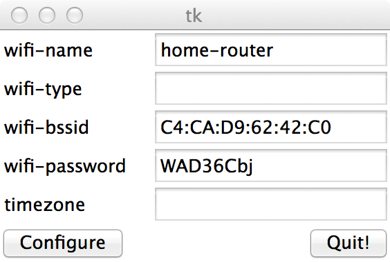

Wifi Settings for Matchstick via USB/adb
========

You can configure the Wifi connection on desktop computer using this tool.

[](./assets/screenshot.png)

Basically, only the ssid, bssid and password are needed.

On Mac OS X and Linux:
```
git clone https://github.com/openflint/wifi-settings-pyadb.git
cd wifi-settings-pyadb/
python settings-app.py
```

On Windows:
```
git clone https://github.com/openflint/wifi-settings-pyadb.git
```
Then double click the settings-app.py (need install python first). A standalone executable will be added later.

